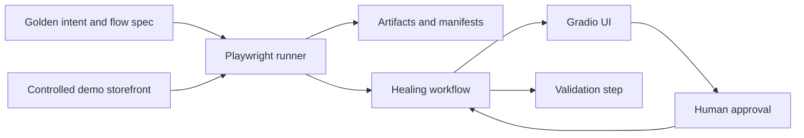

# Architecture Overview

This document explains how the TestPilot MVP is organized and why the repository is structured the way it is.

## Design goals

The repository is optimized for a single supported browser-testing workflow:

- a stable business intent
- one controlled storefront mutation
- deterministic evidence capture
- explicit human approval before a repair is accepted
- reproducible artifacts for review and CI

The architecture favors small, testable modules over a large framework surface.

## System boundaries

## Runtime layers

### 1. Contracts layer

**Files:**
- [testpilot/models.py](testpilot/models.py)

This is the source of truth for:

- the golden intent
- the supported flow specification
- locator resolution strategy
- diagnosis and repair schemas
- validation result shape
- run state and final run result

Why it exists:

- keeps business intent separate from selector implementation
- prevents the flow spec from turning into a locator dump
- gives the rest of the codebase a shared contract

### 2. Browser execution layer

**Files:**
- [testpilot/browser/runner.py](testpilot/browser/runner.py)

This module owns the real Playwright journey.

Responsibilities:

- build target URL candidates from `BASE_URL`
- execute brittle and repaired locator strategies
- capture screenshots on failure
- write run manifests and artifact folders
- preserve backward-compatible helper names for tests

Why it exists:

- all browser behavior should be exercised through one path
- failure evidence should be consistent across the UI, tests, and evals
- deployment-specific URL behavior stays inside the runner instead of spreading through the app

### 3. Workflow layer

**Files:**
- [testpilot/workflow/healing.py](testpilot/workflow/healing.py)
- [testpilot/workflow/graph.py](testpilot/workflow/graph.py)
- [testpilot/workflow/validator.py](testpilot/workflow/validator.py)
- [testpilot/workflow/diagnosis.py](testpilot/workflow/diagnosis.py)
- [testpilot/workflow/repair.py](testpilot/workflow/repair.py)

This layer coordinates the self-healing loop:

- run the brittle journey
- derive diagnosis and repair proposal
- wait for explicit approval
- validate the proposed repair on a live page
- rerun the full journey with the repaired strategy

Why it exists:

- the orchestration logic is easier to test when it is not mixed into the UI
- the approval gate needs to remain explicit and visible
- the workflow can evolve from deterministic orchestration to LangGraph without changing the public surface

### 4. UI layer

**Files:**
- [testpilot/ui/layout.py](testpilot/ui/layout.py)
- [testpilot/ui/services.py](testpilot/ui/services.py)

The UI layer is intentionally thin.

Responsibilities:

- render the mutation selector and evidence panels
- call the service layer for all real work
- display the target URL, timeline, error excerpt, screenshot, proposal, and manifest path

Why it exists:

- thin callbacks are easier to test
- the product surface stays separate from workflow logic
- manual UI acceptance can be simulated through the service functions during development

### 5. LLM layer

**Files:**
- [testpilot/llm/](testpilot/llm/)
- [prompts/](prompts/)

The LLM layer is narrow and optional.

Responsibilities:

- load specialist system prompts from disk
- enforce schema-bound outputs
- fall back to deterministic behavior when `DEMO_MODE=true`, when API keys are absent, or when parsing fails

Why it exists:

- the project should remain deterministic in CI
- the LLM path should be easy to disable or replace
- specialist prompts are easier to reason about than a generic free-form agent

### 6. Demo storefront layer

**Files:**
- [demo_site/index.html](demo_site/index.html)

This is the controlled mutation lab.

Responsibilities:

- serve the stable baseline UI
- support `mutation=baseline` and `mutation=testid_removed`
- keep the journey simple and reproducible

Why it exists:

- the MVP must be safe, self-contained, and judge-friendly
- real public websites would make the demo non-deterministic

### 7. Entry point and deployment layer

**Files:**
- [app.py](app.py)
- [Dockerfile](Dockerfile)
- [render.yaml](render.yaml)
- [.github/workflows/ci.yml](.github/workflows/ci.yml)

Responsibilities:

- mount Gradio at `/`
- expose the storefront at `/shop`
- expose run artifacts at `/artifacts` and `/app/artifacts`
- honor dynamic `PORT`
- keep CI deterministic
- define Docker and Render deployment behavior

## Key runtime assumptions

These are the assumptions that hold the MVP together:

- `BASE_URL` points to a reachable storefront host.
- The storefront serves `index.html` for the mutation lab.
- `DEMO_MODE=true` disables live LLM dependency in automation.
- Repairs are never auto-applied.
- Every successful or failed run writes a manifest.
- Browser evidence lives in `artifacts/`, not in memory only.

## Artifact model

Every run should leave behind a small, inspectable trail:

- `run_manifest.json`
- optional failure screenshot
- optional trace ZIP if capture is enabled
- run-specific folder named by `run_id`

This makes the system useful for both debugging and public review.

## Why the repository is split this way

The structure is intentionally boring in the right places:

- business intent is centralized
- browser execution is centralized
- the UI is thin
- deployment is explicit
- test and eval layers are separated

That keeps the project easier to audit, easier to test, and easier to contribute to.

## If you are changing the code

Use this rule of thumb:

- if the change affects business intent or contracts, start in `testpilot/models.py`
- if it affects browser behavior, start in `testpilot/browser/runner.py`
- if it affects the user experience, start in `testpilot/ui/services.py` and `testpilot/ui/layout.py`
- if it affects approval or validation, start in `testpilot/workflow/`
- if it affects deployment, start in `app.py`, `Dockerfile`, `render.yaml`, or `.github/workflows/ci.yml`

That will keep changes aligned with the repository’s separation of concerns.
