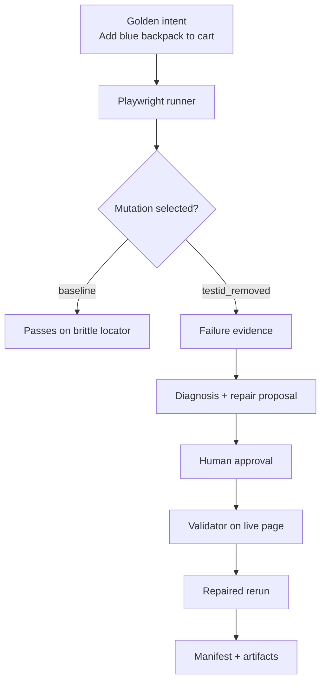

# TestPilot

[](https://github.com/petrubirgoveanu/TestPilot-GUI/actions/workflows/ci.yml)
[](https://www.python.org/downloads/release/python-3110/)
[](https://www.docker.com/)
[](https://www.gradio.app/)

TestPilot is an AI-assisted browser testing MVP that demonstrates how a controlled UI mutation can break a Playwright journey, surface evidence, propose a safe repair, and validate the repaired flow after explicit human approval.

The project is intentionally narrow:
- one supported user journey
- one controlled storefront mutation
- deterministic behavior by default
- public, auditable artifacts for every run

## Product Vision

Browser tests usually fail because the selector strategy drifted while the business intent stayed the same. TestPilot focuses on that problem only: it turns a stable user intent into a structured flow, runs the browser against a controlled storefront, captures the failure, and applies a repair only after a human accepts it.

The business value is simple:
- reduce time spent diagnosing locator breakage
- keep repair decisions auditable
- preserve the underlying user intent across UI changes
- provide a reproducible demo for teams evaluating self-healing workflows

## What It Does

- Renders a Gradio UI for selecting the controlled storefront mutation.
- Executes the real Playwright runner against the demo storefront.
- Captures failure evidence such as error excerpts and screenshots.
- Produces a deterministic diagnosis and repair proposal.
- Requires explicit approval before validation and rerun.
- Records per-run manifests under `artifacts/<run_id>/run_manifest.json`.
- Supports deterministic fallback mode for CI and local development.

## How It Works



The repository separates the major responsibilities into small modules:

| Layer | Responsibility | Key files |
| --- | --- | --- |
| Contracts | Golden intent, flow spec, run state, diagnosis and repair schemas | [testpilot/models.py](testpilot/models.py) |
| Browser execution | Playwright journeys, URL candidates, screenshots, manifests | [testpilot/browser/runner.py](testpilot/browser/runner.py) |
| Workflow | Deterministic healing and LangGraph orchestration | [testpilot/workflow/](testpilot/workflow/) |
| UI | Gradio layout and service layer | [testpilot/ui/layout.py](testpilot/ui/layout.py), [testpilot/ui/services.py](testpilot/ui/services.py) |
| Demo storefront | Controlled mutation lab for the test journey | [demo_site/index.html](demo_site/index.html) |
| Entry point | FastAPI + Gradio app startup and static route mounting | [app.py](app.py) |

## Key Entry Points

If you want to understand or change the system quickly, start here:

- [app.py](app.py): application entry point, Gradio mount, health routes, storefront and artifact static mounts.
- [testpilot/models.py](testpilot/models.py): canonical contracts for the golden intent and repair state.
- [testpilot/browser/runner.py](testpilot/browser/runner.py): the real browser execution path.
- [testpilot/ui/services.py](testpilot/ui/services.py): thin service layer used by the UI and tests.
- [testpilot/ui/layout.py](testpilot/ui/layout.py): the Gradio product surface.
- [testpilot/workflow/healing.py](testpilot/workflow/healing.py): deterministic approval + validation flow.
- [testpilot/workflow/graph.py](testpilot/workflow/graph.py): LangGraph orchestration for the workflow layer.
- [evals/run_evals.py](evals/run_evals.py): scenario-based acceptance harness.
- [docs/how-to-test-m9.md](docs/how-to-test-m9.md): current CI, Docker, and deployment verification guide.

## Quick Start

### Prerequisites

- Python 3.11
- A virtual environment
- Chromium for Playwright
- A terminal capable of running the local storefront server

### Install

```powershell
python -m pip install --upgrade pip
python -m pip install -r requirements.txt
python -m playwright install chromium
```

### Run the storefront

```powershell
python -m http.server 8080 --directory demo_site
```

### Run the app

```powershell
python app.py
```

Open:

- http://127.0.0.1:7860

### Verify locally

```powershell
python -m pytest tests/unit -q --tb=no
python -m pytest tests/integration -q --tb=no
python -m pytest tests/e2e -q --tb=no
python -m evals.run_evals
```

### Recommended environment variables

```powershell
$env:DEMO_MODE = "true"
$env:LANGSMITH_TRACING = "false"
$env:OPENROUTER_API_KEY = ""
$env:BASE_URL = "http://localhost:8080"
```

## API and Runtime Surface

This repository does not expose a public REST API.

The runtime surface is intentionally small:

- `GET /` - Gradio app
- `GET /health` - health check
- `GET /healthz` - alternate health check
- `GET /shop/*` - demo storefront static files
- `GET /artifacts/*` and `GET /app/artifacts/*` - run artifacts and manifests

The internal Python entry points are the real interface for contributors. The UI and workflows call those modules directly, which keeps tests fast and makes the system easier to reason about.

## Deployment

TestPilot currently supports Docker-based deployment paths with matching documentation:

- Render: [docs/render-free-deployment-guide.md](docs/render-free-deployment-guide.md)
- Railway: [docs/railway-deployment-guide.md](docs/railway-deployment-guide.md)
- Hugging Face Spaces: [docs/huggingface-spaces-deployment-guide.md](docs/huggingface-spaces-deployment-guide.md)

The canonical runtime behavior is:
- Docker starts [app.py](app.py)
- the app reads `PORT` dynamically
- the storefront can be served from `/shop`
- artifacts are mounted under `/artifacts`

### CI pipeline

The GitHub Actions workflow:
- installs dependencies and Chromium
- starts the controlled storefront
- runs unit, integration, e2e, and eval checks
- builds the Docker image
- uploads artifacts on failure

See [.github/workflows/ci.yml](.github/workflows/ci.yml) for the exact pipeline.

## Repository Layout

```text
.
├── app.py
├── demo_site/
├── docs/
├── evals/
├── prompts/
├── scripts/
├── testpilot/
└── tests/
```

A few conventions matter for contributors:

- Keep `demo_site/` deterministic and small.
- Treat `testpilot/models.py` as the source of truth for the supported journey.
- Keep UI callbacks thin and move actual work into `testpilot/ui/services.py`.
- Preserve the approval gate; repairs are never auto-applied.
- Store evidence in `artifacts/<run_id>/`, not in ad hoc files.

## Contributing

Read the contributor guide before opening a pull request:

- [CONTRIBUTING.md](CONTRIBUTING.md)
- [ARCHITECTURE.md](ARCHITECTURE.md)

Helpful docs for implementers and reviewers:

- [docs/how-to-test-m4.md](docs/how-to-test-m4.md)
- [docs/how-to-test-m5.md](docs/how-to-test-m5.md)
- [docs/how-to-test-m6.md](docs/how-to-test-m6.md)
- [docs/how-to-test-m7.md](docs/how-to-test-m7.md)
- [docs/how-to-test-m8.md](docs/how-to-test-m8.md)
- [docs/how-to-test-m9.md](docs/how-to-test-m9.md)

### Before you submit

- Run the relevant tests for the area you changed.
- Keep changes small and focused.
- Update docs if the user-facing behavior changes.
- Do not commit secrets, generated artifacts, or local environment files.

## Roadmap

The public MVP is intentionally constrained. Likely next steps are:

- support more controlled mutation types beyond `testid_removed`
- surface artifact browsing more explicitly in the UI
- improve trace/download ergonomics for debugging runs
- expand eval coverage with more supported journey cases
- refine the public documentation as deployment targets evolve

## Known Limitations

- The system is not a general-purpose self-healing browser agent.
- The storefront is controlled and purpose-built for the demo.
- End-to-end flows depend on the storefront being reachable at `BASE_URL`.
- Playwright runs are headless by default in CI and normal automation.
- Some workflow paths still rely on deterministic fallback behavior when `DEMO_MODE=true`.

## License

MIT License. See [LICENSE](LICENSE) for the full text.
